# Focus Service Architecture

## Overview

The Focus service is built following **Clean Architecture** principles (hexagonal architecture), ensuring separation of concerns, testability, and independence from frameworks and external systems. The application manages user focus sessions and categories for time tracking and productivity analysis.

## Core Concepts

- **Focus Sessions**: Time-bound work sessions that can be categorized and annotated
- **Categories**: User-defined labels for organizing and categorizing focus sessions
- **Authentication**: Session-based authentication with CSRF protection, validated via gRPC calls to the Auth service

## Clean Architecture Layers

```mermaid
graph TB
    subgraph "External Systems"
        FE[Frontend<br/>Next.js]
        AUTH[Auth Service<br/>gRPC]
        DB[(PostgreSQL)]
    end

    subgraph "Frameworks & Drivers"
        REST[REST Framework<br/>JAX-RS]
        JPA[JPA Repositories<br/>Hibernate]
        MAPPER[Entity Mappers]
        HEALTH[Health Checks]
        FILTER[Auth Filter]
        CONFIG[Configuration<br/>Wiring & DI]
    end

    subgraph "Interface Adapters"
        CTRL[Controllers<br/>Session, Category, Auth]
        PRES[Presenters<br/>JSON HTTP]
        SEC[Security<br/>CurrentUser]
        GRPC[gRPC Client<br/>AuthGrpcClient]
    end

    subgraph "Use Cases"
        INT[Interactors<br/>Start/Stop/Resume Session<br/>Create/Archive Category]
        PORTS[Ports<br/>FocusSessionRepository<br/>CategoryRepository<br/>AuthSessionRepository<br/>AuthService, EventPublisher]
        POL[Policies<br/>RunningSession<br/>UniqueCategoryName]
        FAC[Factories<br/>ValueObjectFactory]
    end

    subgraph "Entities - Domain Core"
        ENT[Entities<br/>FocusSession, Category]
        VO[Value Objects<br/>CategoryName, Color<br/>Note, TimeRange]
        ID[IDs<br/>CategoryId, FocusSessionId<br/>UserId]
        EV[Domain Events<br/>SessionStarted<br/>CategoryCreated]
        ERR[Domain Errors<br/>Business Rules]
    end

    FE -->|HTTPS| REST
    CTRL --> REST
    CTRL --> PRES
    CTRL --> INT
    CTRL --> PORTS
    GRPC -->|Authenticate| AUTH
    GRPC -.implements.-> PORTS
    JPA -->|SQL| DB
    
    CONFIG -.configures.-> INT
    CONFIG -.configures.-> JPA
    CONFIG -.configures.-> GRPC
    
    INT --> PORTS
    INT --> POL
    INT --> FAC
    JPA -.implements.-> PORTS
    JPA --> MAPPER
    FILTER --> SEC
    FILTER --> PORTS
    
    INT --> ENT
    ENT --> VO
    ENT --> ID
    ENT --> EV
    ENT --> ERR

    classDef external fill:#e1f5ff,stroke:#01579b
    classDef framework fill:#fff3e0,stroke:#e65100
    classDef adapter fill:#f3e5f5,stroke:#4a148c
    classDef usecase fill:#fce4ec,stroke:#880e4f
    classDef entity fill:#e8f5e9,stroke:#1b5e20
    
    class FE,AUTH,DB external
    class REST,JPA,MAPPER,HEALTH,FILTER,CONFIG framework
    class CTRL,PRES,SEC,GRPC adapter
    class INT,PORTS,POL,FAC usecase
    class ENT,VO,ID,EV,ERR entity
```

## Component Breakdown

### 1. Entities Layer (Domain Core)

**Location**: `src/main/java/de/thi/focus/entities/`

The innermost layer containing pure business logic with no external dependencies.

#### Core Entities
- **`FocusSession`**: Represents a time-bound focus session
  - Properties: id, userId, startAt, endAt, categoryId, note
  - Business rules: Cannot stop already stopped session, time range validation
  
- **`Category`**: User-defined session categorization
  - Properties: id, userId, name, color, archived
  - Business rules: Name validation, archive/unarchive state management

#### Value Objects
- **`CategoryName`**: Enforces category name constraints (max length)
- **`Color`**: Validates hex color format (#RRGGBB)
- **`Note`**: Session notes with length constraints
- **`TimeRange`**: Validates start/end time logic

#### IDs (Type-Safe Identifiers)
- **`UserId`**, **`CategoryId`**, **`FocusSessionId`**: Prevent primitive obsession

#### Domain Events
- **`FocusSessionStarted`**, **`FocusSessionStopped`**
- **`CategoryCreated`**, **`CategoryArchived`**

#### Domain Errors
Custom exceptions enforcing business rules:
- `InvalidCategoryNameException`, `NoteTooLongException`
- `SessionAlreadyStoppedException`, `InvalidTimeRangeException`

### 2. Use Cases Layer

**Location**: `src/main/java/de/thi/focus/usecases/`

Application-specific business rules orchestrating entity interactions.

#### Interactors (Use Case Implementations)

**Session Management:**
- **`StartSessionInteractor`**: Creates new focus session
- **`StopSessionInteractor`**: Ends running session
- **`ResumeSessionInteractor`**: Continues previous session with same category/note
- **`UpdateSessionInteractor`**: Modifies session details
- **`GetRunningSessionInteractor`**: Retrieves active session
- **`ListSessionsInteractor`**: Returns all user sessions

**Category Management:**
- **`CreateCategoryInteractor`**: Creates new category
- **`DeleteCategoryInteractor`**: Removes category (if not in use)
- **`ArchiveCategoryInteractor`**: Archives category
- **`UnarchiveCategoryInteractor`**: Restores archived category
- **`ChangeCategoryColorInteractor`**: Updates category color
- **`RenameCategoryInteractor`**: Changes category name
- **`ListCategoriesInteractor`**: Returns all user categories

#### Ports (Dependency Inversion)

**Inbound Ports** (Driven by adapters):
- Interfaces for each use case (e.g., `StartSessionInputPort`)
- Define what the application can do

**Outbound Ports** (Driving external systems):
- **`FocusSessionRepository`**: Session persistence abstraction
- **`CategoryRepository`**: Category persistence abstraction
- **`AuthSessionRepository`**: Auth session persistence abstraction
- **`AuthService`**: Authentication validation (gRPC)
- **`EventPublisher`**: Domain event publishing
- **`Clock`**: Time provider for testability

#### Policies (Business Rules)
- **`RunningSessionPolicy`**: Ensures only one active session per user
- **`UniqueCategoryNamePolicy`**: Prevents duplicate category names per user

#### Factories
- **`FocusValueObjectFactory`**: Creates validated value objects with configuration

### 3. Interface Adapters Layer

**Location**: `src/main/java/de/thi/focus/interfaceadapters/`

Converts data between use cases and external systems.

#### Web Controllers (JAX-RS)
- **`SessionController`**: REST endpoints for session operations
  - `POST /sessions/start`, `/sessions/stop`, `/sessions/resume`
  - `GET /sessions/running`, `/sessions` (list all)
  - `POST /sessions/update`

- **`CategoryController`**: REST endpoints for category management
  - `POST /categories/create`, `/categories/delete`
  - `POST /categories/archive`, `/categories/unarchive`
  - `GET /categories` (list all)
  - `POST /categories/rename`, `/categories/change-color`

- **`AuthController`**: Session authentication
  - `POST /auth/session`: Validates Bearer token via gRPC, creates session cookies
  - `POST /auth/logout`: Revokes session

- **`RootController`**: API information endpoint
  - `GET /`: Returns service metadata

#### Security
- **`CurrentUser`**: Request-scoped user context providing authenticated user information

#### Presenters
- **`JsonSessionHttpPresenter`**: Formats session responses
- **`JsonCategoryHttpPresenter`**: Formats category responses

#### gRPC Clients
- **`AuthGrpcClient`**: Calls auth service for token validation

#### Health Endpoints
- **`HealthResource`**: `/healthz` - Liveness probe
- **`ReadinessResource`**: `/readyz` - Readiness probe (includes DB check)

### 4. Frameworks & Drivers Layer

**Location**: `src/main/java/de/thi/focus/frameworksdrivers/`

External concerns and implementation details.

#### Web Filters (JAX-RS)
- **`SessionAuthFilter`**: JAX-RS ContainerRequestFilter for authentication/authorization
  - Depends on `AuthSessionRepository` port (not concrete implementation)
  - Validates `focus_sid` cookie against database
  - Enforces CSRF token (`X-CSRF-Token` header) for state-changing requests (POST, PUT, DELETE)
  - Excludes: `/auth/*`, `/`, `/healthz`, `/readyz`, OPTIONS requests
  - Populates `CurrentUser` context for authenticated requests

#### Persistence (JPA/Hibernate)
- **JPA Repositories** (implement repository ports from Use Cases layer):
  - `JpaFocusSessionRepository`: Session CRUD operations (implements `FocusSessionRepository`)
  - `JpaCategoryRepository`: Category CRUD operations (implements `CategoryRepository`)
  - `JpaAuthSessionRepository`: Auth session management (implements `AuthSessionRepository`)

- **JPA Entities**: Database table mappings
  - `FocusSessionEntity`, `CategoryEntity`, `AuthSessionEntity`

- **Mappers**: Convert between domain entities and JPA entities
  - `FocusSessionMapper`, `CategoryMapper`

- **In-Memory Implementations** (for testing):
  - `InMemoryFocusSessionRepository`
  - `InMemoryCategoryRepository`

#### Infrastructure
- **`SystemClock`**: Production time provider
- **`NoopEventPublisher`**: Event publishing (currently no-op)

#### Database Migrations (Flyway)
- **V1__init.sql**: Initial schema (focus_sessions, categories)
- **V2__auth_sessions.sql**: Authentication session table

## Configuration & Dependency Injection

**Location**: `src/main/java/de/thi/focus/config/`

- **`ApplicationWiring`**: CDI producers wiring use cases with dependencies
- **`FocusConstraintsConfig`**: Business constraint configuration (note max length, category name max length)
- **`FocusDefaultsConfig`**: Default values (category color)

## API Endpoints

### Sessions
- `POST /sessions/start` - Start new session
- `POST /sessions/stop?sessionId={id}` - Stop running session
- `POST /sessions/resume?previousSessionId={id}` - Resume previous session
- `GET /sessions/running` - Get active session
- `GET /sessions` - List all user sessions
- `POST /sessions/update?sessionId={id}` - Update session details

### Categories
- `POST /categories/create` - Create category
- `POST /categories/delete?categoryId={id}` - Delete category
- `POST /categories/archive?categoryId={id}` - Archive category
- `POST /categories/unarchive?categoryId={id}` - Unarchive category
- `GET /categories` - List all user categories
- `POST /categories/rename?categoryId={id}` - Rename category
- `POST /categories/change-color?categoryId={id}` - Change category color

### Authentication
- `POST /auth/session` - Create focus session (requires Auth service JWT)
- `POST /auth/logout` - Revoke session

### Operational
- `GET /` - API information
- `GET /healthz` - Liveness probe
- `GET /readyz` - Readiness probe (includes DB check)

## Cross-Site Cookie Configuration

For cross-domain communication (frontend ↔ focus service on different domains):
- Cookies use `SameSite=None; Secure` attributes
- Requires HTTPS (provided by AWS ALB with ACM certificate)
- CORS configured to allow frontend origin with credentials

## Design Patterns

1. **Clean Architecture / Hexagonal Architecture**: Clear separation of concerns
2. **Dependency Inversion**: Use cases depend on abstractions (ports), not implementations
3. **Repository Pattern**: Abstract data access
4. **Factory Pattern**: Value object creation
5. **Policy Pattern**: Reusable business rules
6. **Presenter Pattern**: Format use case outputs for HTTP
7. **Filter Pattern**: Request authentication/authorization
8. **Mapper Pattern**: Convert between layers
